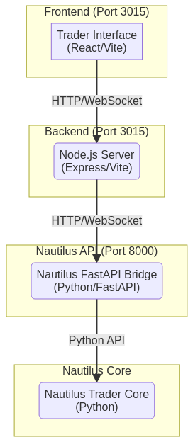

# Nautilus Trader Integration Plan

**Author:** Manus AI
**Date:** October 19, 2025

## 1. Introduction

This document outlines the plan for integrating the Nautilus Trader core engine with the web-based administration and trading interface. The primary goal is to transition from a mock data-driven application to a fully functional, real-time trading platform.

The integration will be achieved by creating a FastAPI bridge that exposes the Nautilus Trader core functionalities through a RESTful API and WebSocket endpoints. This bridge will serve as the communication layer between the frontend and the trading engine.

## 2. Architecture

The proposed architecture consists of four main components:

- **Trader Interface:** The React-based frontend application that provides the user interface for trading and administration.
- **Node.js Server:** The backend server that serves the frontend application and provides API endpoints for user authentication and other web-related functionalities.
- **Nautilus FastAPI Bridge:** A Python-based server that wraps the Nautilus Trader core and exposes its functionalities through a RESTful API and WebSockets.
- **Nautilus Trader Core:** The core trading engine that handles all trading logic, data processing, and communication with brokerage APIs.

### 2.1. Communication Flow

1.  The **Trader Interface** communicates with the **Node.js Server** via HTTP requests for web-related functionalities and establishes a WebSocket connection for real-time updates.
2.  The **Node.js Server** acts as a proxy, forwarding API requests and WebSocket traffic to the **Nautilus FastAPI Bridge**.
3.  The **Nautilus FastAPI Bridge** receives requests from the Node.js server, interacts with the **Nautilus Trader Core** using the Python API, and returns the results.
4.  For real-time data, the **Nautilus Trader Core** pushes updates to the **Nautilus FastAPI Bridge**, which then broadcasts them to the connected WebSocket clients (via the Node.js server).

### 2.2. Technology Stack

| Component                  | Technology                               |
| -------------------------- | ---------------------------------------- |
| Trader Interface           | React, TypeScript, Vite, Tailwind CSS    |
| Node.js Server             | Node.js, Express, TypeScript, Vite       |
| Nautilus FastAPI Bridge    | Python, FastAPI, Uvicorn                 |
| Nautilus Trader Core       | Python, Nautilus Trader                  |

## 3. Implementation Plan

The integration will be carried out in three phases:

### Phase 1: FastAPI Bridge and Initial Integration (Completed)

- **Objective:** Create the FastAPI bridge with mock data and integrate it with the frontend.
- **Status:** Completed.
- **Deliverables:**
    - `nautilus_fastapi_bridge.py`: FastAPI application with mock data endpoints.
    - `nautilus-client.ts`: TypeScript client for the Nautilus API.
    - `NautilusDemo.tsx`: A demo page to showcase the integration.

### Phase 2: Real-time Data and Core Integration

- **Objective:** Integrate the FastAPI bridge with the real Nautilus Trader core and enable real-time data streaming.
- **Tasks:**
    1.  Initialize and configure the Nautilus Trader node within the FastAPI bridge.
    2.  Implement the API endpoints to interact with the real Nautilus Trader core (e.g., get strategies, orders, positions).
    3.  Implement the WebSocket server to broadcast real-time updates from the Nautilus Trader core.
    4.  Update the frontend to consume real-time data from the WebSocket.

### Phase 3: Full Integration and Testing

- **Objective:** Complete the integration of all trading functionalities and conduct thorough testing.
- **Tasks:**
    1.  Integrate the remaining trading functionalities (e.g., order creation, strategy management).
    2.  Implement paper trading to test the end-to-end trading workflow.
    3.  Conduct comprehensive testing of all features and functionalities.
    4.  Create a detailed deployment guide and documentation.

## 4. Next Steps

The immediate next step is to begin **Phase 2: Real-time Data and Core Integration**. This will involve replacing the mock data in the FastAPI bridge with real data from the Nautilus Trader core and enabling real-time updates via WebSockets.

